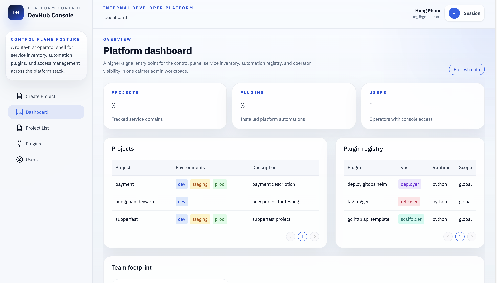

# DevHub

**DevHub** is an internal developer platform control plane for scaffolding services, creating releases, and deploying those releases through a plugin-driven workflow.

> Built with Go, Vue 3, TypeScript, Python plugins, PostgreSQL, Redis, Gitea, and Argo CD.

## What It Does

- Register projects with environment ownership and lifecycle metadata
- Scaffold new services from platform templates
- Create releases for a selected service
- Deploy a chosen release version into `dev`, `staging`, or `prod`
- Track deployment and release history from the control plane UI
- Review approval requests before gated scaffold and deployment actions proceed
- Browse services across projects from a dedicated service inventory page
- Inspect cross-service release activity from a dedicated releases page with a timeline view
- Drive automation through plugin types:
  - `scaffolder`
  - `releaser`
  - `deployer`

## Frontend Flow

The current control-plane UI is organized around this lifecycle:

1. `Dashboard` surfaces team members, project counts, and plugin inventory.
2. `Approvals` lists pending approval requests and lets operators approve or reject with a required comment.
3. `Projects` lists registered projects with ownership and environment filters.
4. `Services` aggregates services across projects.
5. `Releases` aggregates release activity across services and shows a release timeline chart.
6. Clicking a project opens project details with services, recent releases, and recent deployments.
7. From project details, you can open a service.
8. From service details, you can:
   - create a release
   - select a release
   - deploy based on that release version
   - inspect deployments filtered by the selected release tag

## Release Notes Automation

GitHub release notes can be refreshed automatically through the workflow at [release-notes.yml](./.github/workflows/release-notes.yml).

When a GitHub Release is published or edited, the workflow regenerates the release body from GitHub's generated release notes API and updates the release in place.

## Demo

The current DevHub console looks like this:



## Documentation

Detailed docs live in [`docs/`](./docs):

- [Getting Started](./docs/getting-started.md)
- [Architecture](./docs/architecture.md)
- [API Docs](./docs/api.md)
- [Roadmap](./docs/roadmap.md)

This keeps the main project page readable on GitHub while still exposing the deeper documentation from the README.

## Quick Start

```bash
# Clone the repo
git clone https://github.com/phamphihungbk/devhub.git
cd devhub

# Discover available commands
make help

# Prepare local environment files
make bootstrap

# Start the local platform stack
make up

# Run database migrations
make migrate
```

Local access points after startup:

- DevHub UI: [https://devhub.local](https://devhub.local)
- DevHub API host: [https://api.devhub.local](https://api.devhub.local)
- Gitea UI: [https://gitea.devhub.local](https://gitea.devhub.local)
- Argo CD UI: [https://argocd.devhub.local](https://argocd.devhub.local)

To configure those local domains and trust the generated certificate on macOS:

```bash
make setup-local-https
```

Useful follow-up commands:

```bash
# Backend with file watch
make backend-watch

# Frontend watch
make frontend-watch

# Argo CD local UI
make argocd-ui

# Recreate minikube with the local registry enabled
make minikube-registry
```

`make minikube-registry` starts `devhub-registry`, recreates the Minikube cluster with `host.minikube.internal:5001` allowed as an insecure registry, and verifies the registry is reachable from inside Minikube.

## Project Layout

```text
devhub/
├── backend/      # Go API, workers, domain logic, migrations
├── frontend/     # Vue admin console
├── plugins/      # Python scaffold, release, and deploy plugins
├── infra/        # Helm charts, Argo CD manifests, Docker assets
├── scripts/      # Local development helpers
└── docs/         # Project documentation
```

## Notes

- Local Postgres is exposed on `localhost:5433` by default.
- The backend and worker rely on `.env` for Argo CD, SCM, and CI/CD integration settings.
- GitOps and Argo CD setup details are documented in [Getting Started](./docs/getting-started.md).
